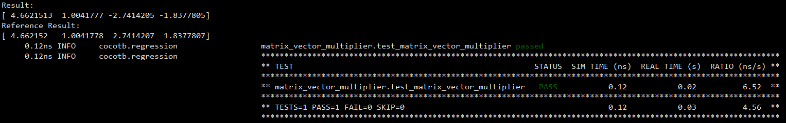
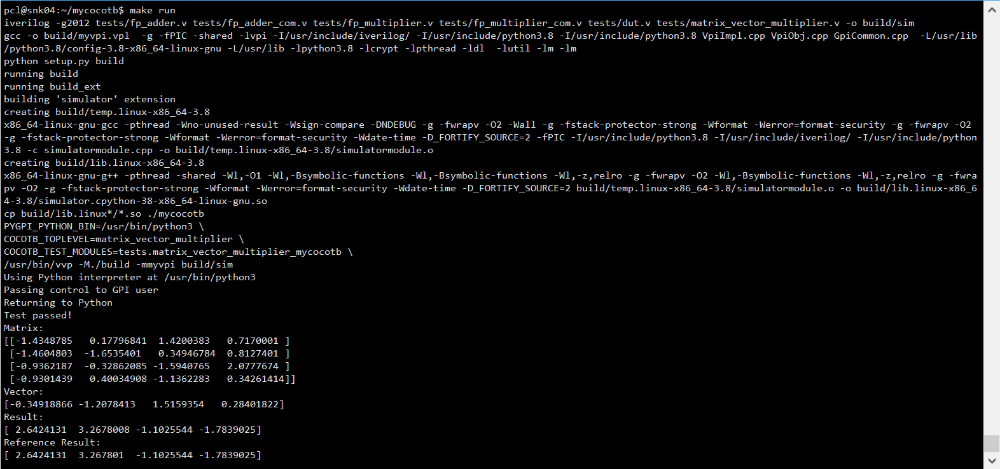

代码部分除非有特殊说明，否则默认修改自[cocotb]()，请遵守原项目的开源协议。其他文字、图片等作者保留所有权利。All rights reserved. 

----------------

### 自己写一个cocotb

#### 动机

我初次接触到cocotb是因为corundum，那时候觉得很神奇，竟然可以在python这种这么高层级的脚本语言里去写HDL这种硬件层级代码的仿真验证代码。对于一个写惯了应用层代码的人，实在是太友好了。同时，我也开始好奇，cocotb到底是怎么做到这一点的。所以就萌生了一个想法，自己从头模仿着编写一个cocotb，并保持足够的简单，只是为了弄清楚其中的基本原理。

从25年春节前开始启动，中间陆陆续续投入，每次遇到个小长假，总是觉得有可能完工，但又是跳票。最近狠下心来，熬了几个晚上，总算完成，现在把一些过程的心得记录如下。

项目地址：https://github.com/opensmartnic/mycocotb

#### 目标

1、简单，其实是我一开始追求的目标，能控制在3000行内最好（原cocotb大概3.5万行），如果能用1000行搞定，那就更酷了，不过随着我对项目的了解，发现3000行都很困难，我尽可能的精简了一些（但我又不愿意删掉原项目中一些非常精彩的注释），控制到了8000行以内。当然，其中大概有4000行代码，是为了让python能更优雅地访问HDL中的对象，如果我只提供简单的对象访问，这部分我想大概是能用500行搞定。但其实我也没完全想好，所以就保持现状了。

2、能跑个还行的测试示例。这里我选择了跑一个矩阵乘向量（浮点数）的例子。

3、基本跟原先的语法保持一致。原先是想最好能做到`import mycocotb as cocotb`这样的无缝衔接，但最后为了精简代码，去除了部分注解语法糖和测试管理。所以使用上稍微有些不同。

#### 初探

假设已经有了矩阵乘向量的verilog代码（这里我用组合逻辑粗糙地实现了[一版](https://github.com/opensmartnic/mycocotb/tree/master/tests)），先看下使用cocotb怎么写测试代码（完整版参考[这里](https://github.com/opensmartnic/mycocotb/blob/master/tests/matrix_vector_multiplier.py)）：

```python
import cocotb
from cocotb.triggers import RisingEdge, FallingEdge, Timer
import numpy as np

# 省略部分代码...

async def clock_gen(dut):
    while True:
        dut.clk.value = 0
        await Timer(5)
        dut.clk.value = 1
        await Timer(5)

# 测试用例
@cocotb.test()
async def test_matrix_vector_multiplier(dut):
    # 初始化时钟
    cocotb.start_soon(clock_gen(dut))

    # 复位模块
    dut.rst_n.value = 0
    await RisingEdge(dut.clk)
    await RisingEdge(dut.clk)
    dut.rst_n.value = 1
    await RisingEdge(dut.clk)

    # 测试数据
    test_data = [
        (np.eye(MATRIX_ROWS, MATRIX_COLS).astype(np.float32), np.ones((MATRIX_ROWS, )).astype(np.float32)),
        (generate_random_matrix(MATRIX_ROWS, MATRIX_COLS), generate_random_vector(MATRIX_COLS))
    ]
    for matrix, vector in test_data:
        # 将矩阵和向量加载到DUT
        for i in range(MATRIX_ROWS):
            for j in range(MATRIX_COLS):
                dut.matrix[i*MATRIX_COLS + j].value = float_to_bin32(matrix[i][j])
        for j in range(MATRIX_COLS):
            dut.vector[j].value = float_to_bin32(vector[j])

        # 启动计算
        dut.start.value = 1
        await RisingEdge(dut.clk)
        dut.start.value = 0

        # 等待计算完成
        while dut.done.value != 1:
            await RisingEdge(dut.clk)

        # 读取结果并转换为浮点数
        result = np.zeros(MATRIX_ROWS, dtype=np.float32)
        for i in range(MATRIX_ROWS):
            result[i] = bin32_to_float(dut.result[i].value)

        # 计算参考结果
        reference_result = compute_reference_result(matrix, vector)

        # 验证结果
        assert np.allclose(result, reference_result, rtol=1e-5), \
            f"Test failed: Expected {reference_result}, got {result}"

        # 打印测试结果
        print(f"Reference Result:{reference_result}")
```

这里我们在python中随机产生测试数据，传输到verilog中，然后启动计算，并通过`await RisingEdge(dut.clk)`循环等待直到dut.done的值变为1。然后读取结果，并和numpy计算的结果对比，如果没有太大的差异（理论上应该没有差异，但我的verilog实现中，对最后末位的近似做了简化），就认为测试通过。

配套地，我们在编译一个Makefile：

```Makefile
SIM ?= icarus
TOPLEVEL_LANG ?= verilog

VERILOG_SOURCES += $(PWD)/matrix_vector_multiplier.v
VERILOG_SOURCES += $(PWD)/fp_adder_com.v
VERILOG_SOURCES += $(PWD)/fp_multiplier_com.v

# TOPLEVEL is the name of the toplevel module in your Verilog or VHDL file
TOPLEVEL ?= matrix_vector_multiplier

# MODULE is the basename of the Python test file
MODULE ?= matrix_vector_multiplier

# include cocotb's make rules to take care of the simulator setup
include $(shell cocotb-config --makefiles)/Makefile.sim

```

然后就可以查看原版cocotb的结果，类似下图：



现在切换到[我们的版本](https://github.com/opensmartnic/mycocotb/blob/master/tests/matrix_vector_multiplier_mycocotb.py)。测试代码基本不变，只是需要有下列改动：

```python
import mycocotb as cocotb
from mycocotb.triggers import RisingEdge, FallingEdge, Timer
import sys

# 其他代码都一样

        print(f"Reference Result:{reference_result}")
    # 因为我们没有使用cocotb的test装饰器，所以需要手动退出，
    # 否则会因为时钟一直在运行而导致测试无法结束
    sys.exit()

# 需要由我们手动启动主测试协程，通过start_soon将它添加到任务调度器中
# mycocotb.top指向了verilog代码中的顶层模块，可以传递给dut
cocotb.start_soon(test_matrix_vector_multiplier(cocotb.top))
```

然后再Makefile编写上，我们没有采用原先那种嵌套的编写方法（即`include $(shell cocotb-config --makefiles)/Makefile.sim`，这是为了便利地切换多种仿真软件），而是直接硬写一个：

```Makefile
CC = gcc
CFLAGS = -g -fPIC -shared -lvpi -I/usr/include/iverilog/
V_TARGET = build/sim
C_TARGET = build/myvpi.vpl
C_TARGET_NO_EXT = myvpi
V_SRC = $(wildcard tests/*.v)
C_SRC = VpiImpl.cpp VpiObj.cpp GpiCommon.cpp
C_TO_PY_SRC = simulatormodule.cpp
H_SRC = $(wildcard *.h)
PY_INCLUDE = $(shell python3-config --includes)
PY_LDFLAGS = $(shell python3-config --ldflags --embed)

# mycocotb运行需要的环境变量
COCOTB_TEST_TOPLEVEL ?= dut
COCOTB_TEST_MODULES ?= tests.mytest
COCOTB_RUN_TOPLEVEL ?= matrix_vector_multiplier
COCOTB_RUN_MODULES ?= tests.matrix_vector_multiplier_mycocotb

all: $(V_TARGET) $(C_TARGET)

test: all
	PYGPI_PYTHON_BIN=$(shell which python3) \
	COCOTB_TOPLEVEL=$(COCOTB_TEST_TOPLEVEL) \
	COCOTB_TEST_MODULES=$(COCOTB_TEST_MODULES) \
	/usr/bin/vvp -M./build -m$(C_TARGET_NO_EXT) $(V_TARGET)

run: all
	PYGPI_PYTHON_BIN=$(shell which python3) \
	COCOTB_TOPLEVEL=$(COCOTB_RUN_TOPLEVEL) \
	COCOTB_TEST_MODULES=$(COCOTB_RUN_MODULES) \
	/usr/bin/vvp -M./build -m$(C_TARGET_NO_EXT) $(V_TARGET)

$(V_TARGET): $(V_SRC)
	iverilog -g2012 $^ -o $@

$(C_TARGET): $(C_SRC) $(H_SRC) $(C_TO_PY_SRC)
	$(CC) -o $@  $(CFLAGS) $(PY_INCLUDE) $(C_SRC)  $(PY_LDFLAGS)
	python setup.py build
	cp build/lib.linux*/*.so ./mycocotb

clean:
	# rm -f $(C_TARGET) $(V_TARGET)
	rm mycocotb/*.so
	rm -rf build/*

.PHONY: all run clean test
```

直接运行`make run`会出发整个项目的编译和执行，可以得到类似结果：

 

可以看到测试也是通过的。

#### 架构

项目的代码结构如下（这些代码文件都可以在原cocotb中项目找到对应，不过c++部分有合并其他文件）：

```
├── mycocotb
│   ├── entry.py
│   ├── __init__.py
│   ├── handle.py
│   ├── _outcomes.py
│   ├── _scheduler.py
│   ├── simulator.cpython-38-x86_64-linux-gnu.so
│   ├── task.py
│   ├── triggers.py
│   ├── types
│   │   ├── __init__.py
│   │   ├── array.py
│   │   ├── logic_array.py
│   │   ├── logic.py
│   │   └── range.py
│   ├── _utils.py
│   ├── utils.py
│   └── _write_scheduler.py
├── README.md
├── Makefile
├── setup.py
├── tests
│   ├── fp_adder_com.v
│   ├── fp_multiplier_com.v
│   ├── Makefile
│   ├── matrix_vector_multiplier_mycocotb.py
│   └── matrix_vector_multiplier.py
├── gpi_priv.h
├── GpiCommon.cpp
├── simulatormodule.cpp
├── VpiImpl.h
├── VpiImpl.cpp
└── VpiObj.cpp
```

其中：

* Makefile是上文所使用的启动仿真、编译的脚本，编译包括编译C++代码（使用gcc）成为可被仿真器（vvp）加载的动态库，以及编译C++代码成为可以在python中import的动态库（通过调用`python setup.py build`来实现），具体地说，是生成`simulator.cpython-38-x86_64-linux-gnu.so`文件，它会被自动拷贝到mycocotb目录下，从而在代码中可以使用`from mycocotb import simulator`.

* tests目录下放置了测试代码（即《初探》章节中使用的代码）

* C++代码，包括：gpi_priv.h、GpiCommon.cpp、simulatormodule.cpp、VpiImpl.h、VpiImpl.cpp、VpiObj.cpp。这些代码要负责实现三个功能：一是从仿真器（vvp），通过VPI接口的约定，跳转执行我们编写代码（从而进一步跳转到python中，执行mycocotb的框架代码和用户编写的代码）；二是在执行python代码过程中，根据代码设定，可以在仿真器中注册VPI事件（如延迟X ns、等待某个信号的上升沿等）；三是，可以通过VPI接口获取和设置仿真对象（即verilog代码中的实例）的属性值。

  * gpi_priv.h 和并了原项目中的gpi.h文件，可以只使用一个头文件；这里包含对GpiHdl类（最基础类）的定义，并定义GpiSignalObjHdl类（用于表示verilog实例对象）

  * VpiImpl.cpp/.h，合并了原项目VpiImpl.cpp、VpiCbHdl.cpp、GpiCbHdl.cpp、embed.cpp、gpi_embed.cpp，在这里承担了第一项功能的实现，以及VpiCbHdl的实现，以支持第二项功能

  * simulatormodule.cpp，这是python调用C++方法的入口函数，python代码中await 某个事件、获取/设置某个属性，都是通过这个文件后，再进一步传递到其他C++文件的。

  * VpiObj.cpp主要放置一些verilog实例属性的C++抽象，获取和设置的代码，以及对嵌套实例的搜索代码（如dut.moduleA.signalB)。

* mycocotb目录，放置所有的python代码。实现：（1）承接C++代码进入的入口代码；（2）对用户编写代码的加载；（3）实现协程（async修饰的函数）的进一步包装为Task，并实现对所有Task的调度（也可以称为事件循环处理）；（4）对事件的抽象，或者称为Trigger，作为可以被await的对象，Trigger总是会在某个协程里被await；（5）verilog实例对象的python对象对应，实现python端的对象属性值获取和设置，如支持dut.a.value的读取/设置。

#### 拆解

1、cocotb能实现的基本原理是什么？以verilog+icarus做说明

之所以可以在python中编写仿真代码，是因为Veirlog标准（IEEEE1364-2005、IEEE 1800-2023）明确要求了，仿真器需要支持可编程接口，也就是VPI（Verification Procedural Interface），可以在C语言里实现对特定时间的响应函数的注册（然后在响应函数里进行我们需要的操作）、以及对实例对象属性的获取和设置。

而python语言和C（以及进一步的C++）是可以相互调用的，既可以在C语言里调用和执行python模块和脚本，也可以在python代码里，调用C/C++编译的动态库（以模块包的形式）。所以如果是从仿真器视角，其实它处理的是一堆C代码。

python支持async/await关键字来创建协程，同时也支持自定义事件循环来响应和推进各协程（通过调用各协程所具有的send()方法），为此就可以在cocotb中定义一套调度逻辑，实现协程间的并发。为什么用“并发”这个词呢，是因为各协程在实际被推进时（即被调用了send方法），总是独占地执行，直到遇到了`yield`语句才交出控制权给调度器，让调度器根据需要可以调度下一个协程。（注：本段中提到的协程，具体对应到代码，更应该被称为Task）

实际上，python中的调度器调度执行所有等待队列中的Task的这个行为，是在VPI的响应函数里进行的，而且只要python代码还没结束，那么在这些python代码的某个地方还会通过await 某一个Trigger（可以认为是某个事件）**再次**注册响应函数，从而当本轮调度都执行完一遍了，python代码就结束了，回到了仿真器中，仿真器进行推进verilog代码，直到遇到新注册的响应函数的触发，然后又回到了python，如此反复横跳着前进。

2、从仿真器跳转到python代码的几个主要过程函数？

VPI支持在仿真器启动时注册响应函数，仿真器启动（注意不是verilog开始被执行）时，这些函数也会被执行。

见这段代码：

https://github.com/opensmartnic/mycocotb/blob/7abaa0ae92539da13478363dd0ad78a6c5809020/VpiImpl.cpp#L270

```C
// 在这里定义两个vpi的钩子函数，他们将在仿真器启动时，由仿真器调用执行。
// 实际上只使用一个也行，但cocotb里分成了两个：一个负责初始化python环境，
// 如，获取python库路径、初始化配置等；一个负责执行实际的cocotb的基础python
// 代码，如启动事件循环等，并在启动完成后，跳入用户端的代码开始执行
void (*vlog_startup_routines[])() = {
    gpi_entry_point, register_initial_callback,
    nullptr
};
```

在`register_initial_callback`中，可以开始执行VPI回调函数的注册，启动第一个被注册回调函数是`cbStartOfSimulation`，它也是唯一一个由C语言发起的回调函数，后续其他的回调函数都将由python端发起（当然，具体的实现还是落到C这端）。

为了更优雅地处理注册回调函数的操作，cocotb定义一系列VpiCbHdl类，不同的事件就可以分别使用像具体的子类：VpiStartupCbHdl、VpiTimedCbHdl（延迟某个时间）、VpiValueCbHdl（某个信号值发生变化）、VpiNextPhaseCbHdl（到下一个仿真步）、VpiReadWriteCbHdl（到某一轮信号变更的写阶段）、VpiReadOnlyCbHdl（到某一轮信号变更的读阶段）。

```C++
// VpiCbHdl类定义
class VpiCbHdl {
  public:
    VpiCbHdl();

    virtual int arm_callback();
    virtual int run_callback();
    virtual int cleanup_callback();
    void set_call_state(gpi_cb_state_e new_state);
    gpi_cb_state_e get_call_state();

    int set_user_data(int (*function)(void *), void *cb_data);
    void *get_user_data() noexcept { return m_cb_data; };

    template <typename T> T get_handle() const {
        return static_cast<T>(m_obj_hdl);
    }

  protected:
    s_cb_data cb_data;
    s_vpi_time vpi_time;
    gpi_cb_state_e m_state = GPI_FREE;  // GPI state of the callback through its cycle
    int (*gpi_function)(void *) = nullptr;  // GPI function to callback
    void *m_cb_data = nullptr;  // GPI data supplied to "gpi_function"

    void *m_obj_hdl;  // 在这里存放vpi_register_cb后的返回值，调用vpi_remove_cb时要用
};
```

在VpiCbHdl类的定义中，有了统一的注册动作，即`arm_callback()`，而当这个注册的回调函数被仿真器调用时，run_callback()又回被执行，在run_callback()中还会进一步执行gpi_function函数，而gpi_function其实很接近来自python代码了，它是simulatormodule.cpp中的：

https://github.com/opensmartnic/mycocotb/blob/7abaa0ae92539da13478363dd0ad78a6c5809020/simulatormodule.cpp#L164

```C++
int handle_gpi_callback(void *user_data) {
    to_python();
    DEFER(to_simulator());

    PythonCallback *cb_data = (PythonCallback *)user_data;

    if (cb_data->id_value != COCOTB_ACTIVE_ID) {
        fprintf(stderr, "Userdata corrupted!\n");
        return 1;
    }
    cb_data->id_value = COCOTB_INACTIVE_ID;

    PyGILState_STATE gstate = PyGILState_Ensure();
    DEFER(PyGILState_Release(gstate));

    // Python allowed

    if (!PyCallable_Check(cb_data->function)) {
        fprintf(stderr, "Callback fired but function isn't callable?!\n");
        return 1;
    }

    // Call the callback
    PyObject *pValue =
        PyObject_Call(cb_data->function, cb_data->args, cb_data->kwargs);

    // If the return value is NULL a Python exception has occurred
    // The best thing to do here is shutdown as any subsequent
    // calls will go back to Python which is now in an unknown state
    if (pValue == NULL) {
        PyErr_Print();
        gpi_sim_end();
        return 0;
    }

    // We don't care about the result
    Py_DECREF(pValue);

    // Remove callback data if no longer active
    if (cb_data->id_value == COCOTB_INACTIVE_ID) {
        delete cb_data;
    }

    return 0;
}
```

在`handle_gpi_callback`中其实，会使用一个封装的PythonCallback对象，在里面会保存是具体哪个Trigger注册了这个回调函数，然后就可以实际去执行python代码。

这些python代码根据不同的Trigger（如Event、Timer、NextTimeStep、ReadOnly、ReadWrite，从这些命令我们也大概可以猜出和VpiCbHdl各子类的对应关系）会略微有些不同，但大体逻辑都是，将所有等待本Trigger的所有Task放置到待调度队列中，然后跳转到调度逻辑（调度器自然会被所有被唤醒的Task调度执行一遍）。

两个主要的python事件响应函数是\_sim\_react和\_react（他们会在上文的handle_gpi_callback里被执行）：

https://github.com/opensmartnic/mycocotb/blob/7abaa0ae92539da13478363dd0ad78a6c5809020/mycocotb/_scheduler.py#L157

```python
def _sim_react(self, trigger: Trigger) -> None:
        """Called when a :class:`~cocotb.triggers.GPITrigger` fires.

        This is often the entry point into Python from the simulator,
        so this function is in charge of enabling profiling.
        It must also track the current simulator time phase,
        and start the unstarted event loop.
        """
        # TODO: move state tracking to global variable
        # and handle this via some kind of trigger-specific Python callback
        if trigger is self._read_write:
            mycocotb.sim_phase = mycocotb.SimPhase.READ_WRITE
        elif trigger is self._read_only:
            mycocotb.sim_phase = mycocotb.SimPhase.READ_ONLY
        else:
            mycocotb.sim_phase = mycocotb.SimPhase.NORMAL
        # apply inertial writes if ReadWrite
        if trigger is self._read_write:
            mycocotb._write_scheduler.apply_scheduled_writes()
        self._react(trigger)
        self._event_loop()

    def _react(self, trigger: Trigger) -> None:
        """Called when a :class:`~cocotb.triggers.Trigger` fires.

        Finds all Tasks waiting on the Trigger that fired and queues them.
        """
        if _debug:
            self.log.debug(f"Trigger fired: {trigger}")

        # find all tasks waiting on trigger that fired
        try:
            # 这里将查找所有在等待被激活的Trigger的Task
            scheduling = self._trigger2tasks.pop(trigger)
        except KeyError:
            # GPI triggers should only be ever pending if there is an
            # associated task waiting on that trigger, otherwise it would
            # have been unprimed already
            if isinstance(trigger, GPITrigger):
                self.log.critical(f"No tasks waiting on trigger that fired: {trigger}")
                trigger.log.info("I'm the culprit")
            return

        # queue all tasks to wake up
        for task in scheduling:
            # unset trigger
            task._trigger = None
            self._schedule_task(task)

        # cleanup trigger
        trigger._cleanup()
```

3、调度器有哪些相关的对象和方法？

调度器实例是在mycocot/\_\_init\_\_.py中实例化的：

https://github.com/opensmartnic/mycocotb/blob/7abaa0ae92539da13478363dd0ad78a6c5809020/mycocotb/__init__.py#L215

```python
    # setup global scheduler system
    global _scheduler_inst
    # 这里原先的代码可以在一次测试结束后继续执行下一个测试
    # 我们进行了简化，假设用户将只进行一次测试，即给test_complete_cb赋一个空值
    _scheduler_inst = Scheduler(test_complete_cb=lambda: None)
```

Scheduler的主要循环是\_event\_loop:

https://github.com/opensmartnic/mycocotb/blob/7abaa0ae92539da13478363dd0ad78a6c5809020/mycocotb/_scheduler.py#L221

```python
    def _event_loop(self) -> None:
        """Run the main event loop.

        This should only be started by:
        * The beginning of a test, when there is no trigger to react to
        * A GPI trigger
        """

        while self._scheduled_tasks and not self._terminate:
            task, outcome = self._scheduled_tasks.popitem(last=False)

            if _debug:
                self.log.debug(f"Scheduling task {task}")
            self._resume_task(task, outcome)
            if _debug:
                self.log.debug(f"Scheduled task {task}")

            # remove our reference to the objects at the end of each loop,
            # to try and avoid them being destroyed at a weird time (as
            # happened in gh-957)
            del task

            # Schedule may have queued up some events so we'll burn through those
            while self._pending_events:
                if _debug:
                    self.log.debug(
                        f"Scheduling pending event {self._pending_events[0]}"
                    )
                self._pending_events.pop(0).set()

        # no more pending tasks
        if self._terminate:
            self._handle_termination()
        elif _debug:
            self.log.debug("All tasks scheduled, handing control back to simulator")

```

在这个事件循环中，调度器会给每个待调度Task，发送一次send()，并把上次结果也一并发送，这样Task可以继续进行。当然，Task之所以会出现在待调度队列里，是因为它要么是刚初始化，要么是所等待的Trigger被仿真器触发了，进而在回调函数把这个Task放进了待调度队列。

在mycocot/\_\_init\_\_.py还定义了start_soon方法，可以将一个协程或Task放入到待调度队列里。

4、所有的Trigger都是跟仿真器相关的吗？

不是的，像Timer、NextTimeStep、ReadOnly、ReadWrite是由仿真器触发的，但Event是可以由其他Task通过调用Event.set()方法来触发。可以类比Event是软中断。

5、python端是怎么访问某个verilog中的信号的？

首先，在python代码被初始化时，cocotb就会尝试去获取verilog中的最顶层的模块对象：

https://github.com/opensmartnic/mycocotb/blob/7abaa0ae92539da13478363dd0ad78a6c5809020/mycocotb/__init__.py#L253

```python
def _setup_root_handle() -> None:
    root_name = os.getenv("COCOTB_TOPLEVEL")
    if root_name is not None:
        root_name = root_name.strip()
        if root_name == "":
            root_name = None
        elif "." in root_name:
            # Skip any library component of the toplevel
            root_name = root_name.split(".", 1)[1]

    from mycocotb import simulator
    # 在这里获取顶层模块对象
    handle = simulator.get_root_handle(root_name)
    if not handle:
        raise RuntimeError(f"Can not find root handle {root_name!r}")

    global top
    top = mycocotb.handle.SimHandle(handle)
```

这里也发现了verilog中顶层模块的名称是，通过环境变量`COCOTB_TOPLEVEL`传递的。实际获取顶层模块对象（或则这里说的根对象），是通过：

https://github.com/opensmartnic/mycocotb/blob/7abaa0ae92539da13478363dd0ad78a6c5809020/simulatormodule.cpp#L523

```C++
static PyObject *get_root_handle(PyObject *, PyObject *args) {
    const char *name;

    if (!PyArg_ParseTuple(args, "z:get_root_handle", &name)) {
        return NULL;
    }

    gpi_sim_hdl result = gpi_get_root_handle(name);
    if (NULL == result) {
        Py_RETURN_NONE;
    }

    return gpi_hdl_New(result);
}
```

https://github.com/opensmartnic/mycocotb/blob/7abaa0ae92539da13478363dd0ad78a6c5809020/GpiCommon.cpp#L112

```C++
// 获取verilog中的对象，会在python端作为入口，然后跳入simulatormodule，
// 在然后在这里实际调用vpi接口来获取/设置数据
GpiObjHdl *get_root_handle(const char *name) {
    vpiHandle root;
    vpiHandle iterator;
    GpiObjHdl *rv;
    std::string root_name;

    // vpi_iterate with a ref of NULL returns the top level module
    iterator = vpi_iterate(vpiModule, NULL);
    check_vpi_error();
    if (!iterator) {
        LOG_INFO("Nothing visible via VPI");
        return NULL;
    }

    for (root = vpi_scan(iterator); root != NULL; root = vpi_scan(iterator)) {
        if (to_gpi_objtype(vpi_get(vpiType, root)) != GPI_MODULE) continue;

        if (name == NULL || !strcmp(name, vpi_get_str(vpiFullName, root)))
            break;
    }
    ...
    ...
}
```

有了根对象，就可以继续往下一层级获取其子对象，cococtb提供了gpi_get_handle_by_name和gpi_get_handle_by_index来分别使用名称和数字索引获取子对象。并配合handle.py（以及types/logic.py, types/logic_array.py）来实现对仿真对象信号的python对应。

比如

https://github.com/opensmartnic/mycocotb/blob/7abaa0ae92539da13478363dd0ad78a6c5809020/mycocotb/handle.py#L740

```python
class LogicArrayObject(
    ValueObjectBase[LogicArray, Union[LogicArray, Logic, int, str]],
):
    def __init__(self, handle: simulator.gpi_sim_hdl, path: Optional[str]) -> None:
        super().__init__(handle, path)

    def _set_value(
        self,
        value: Union[LogicArray, Logic, int, str],
        action: _GPISetAction,
        schedule_write: Callable[
            [ValueObjectBase[Any, Any], Callable[..., None], Sequence[Any]], None
        ],
    ) -> None:
        value_: str
        if isinstance(value, int):
            min_val, max_val = _value_limits(len(self), _Limits.VECTOR_NBIT)
            if min_val <= value <= max_val:
                if len(self) <= 32:
                    schedule_write(
                        self, self._handle.set_signal_val_int, (action, value)
                    )
                    return

                ...
		...
        schedule_write(self, self._handle.set_signal_val_binstr, (action, value_))

    @property
    def value(self) -> LogicArray:
        binstr = self._handle.get_signal_val_binstr()
        return LogicArray._from_handle(binstr)

    @value.setter
    def value(self, value: LogicArray) -> None:
        self.set(value)
```

这里我们能发现，对于具体的信号，可以通过其value属性获取或设置信号的值，具体的C实现则是在simulatormodule.cpp中的get_signal_val_binstr、set_signal_val_binstr、set_signal_val_int。

注：这里cocotb对于verilog实例的抽象，我猜测是出于某些原因，需要使用现在的复杂的层次化管理，所以这里的代码量其实很大。但实际上，如果我们只是要在verilog中读写一个实例，vpi_get_value/vpi_put_value可以很方便地做到，包括层级的对象访问（如dut.m.a)。我尝试要把这块代码去掉，这样可以节省3500行左右，但没有成功，然后由于我们一开始选择了矩阵乘向量这样的测试用例，又需要访问数组对象，这样就还是要依赖原cocotb提供的array对象。遂作罢。

6、cocotb文档里说，对一个对象的写入，如dut.clk = 1是在ReadWrite阶段才生效的，那具体是怎么做的？

当有一个写入请求，如上面代码提到的：

```
schedule_write(self, self._handle.set_signal_val_binstr, (action, value_))
```

它表示的是把写入动作先放入队列，然后触发写入事件，这时其实后台还有一个Task，它不断地等待写入事件，当该事件发生，它会等待一个`await ReadWrite`，然后该Trigger触发时会将所有的写入请求写入：

https://github.com/opensmartnic/mycocotb/blob/7abaa0ae92539da13478363dd0ad78a6c5809020/mycocotb/_write_scheduler.py#L25

```python
async def _do_writes() -> None:
    """An internal task that schedules a ReadWrite to force writes to occur."""
    while True:
        await _writes_pending.wait()
        await ReadWrite()
        # 当ReadWrite触发时，在调度循环里会执行具体的写入操作
```

https://github.com/opensmartnic/mycocotb/blob/7abaa0ae92539da13478363dd0ad78a6c5809020/mycocotb/_scheduler.py#L174

```python
    def _sim_react(self, trigger: Trigger) -> None:
        ...
        if trigger is self._read_write:
            mycocotb._write_scheduler.apply_scheduled_writes()
        ...
```

#### 其他

1、代码是根据https://github.com/cocotb/cocotb/tree/cf9d4c4353080b5592f8bd0b18459d0629bdbb4e 这个时间点还是改的。我在项目里，也保留有历史的git信息，可以在github上浏览文件变更记录。

2、如果想实际调试下mycocotb，建议使用vscode，参考[这里](debug_cocotb_with_vscode.md)

