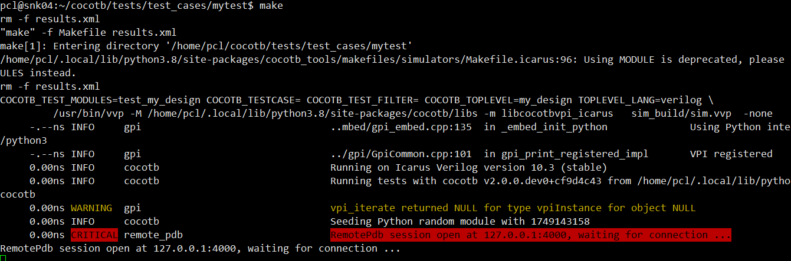
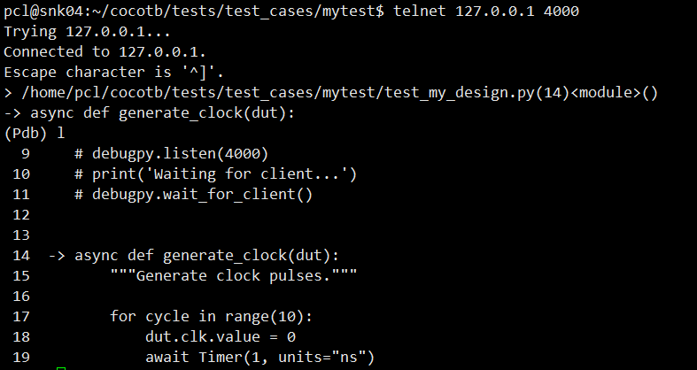
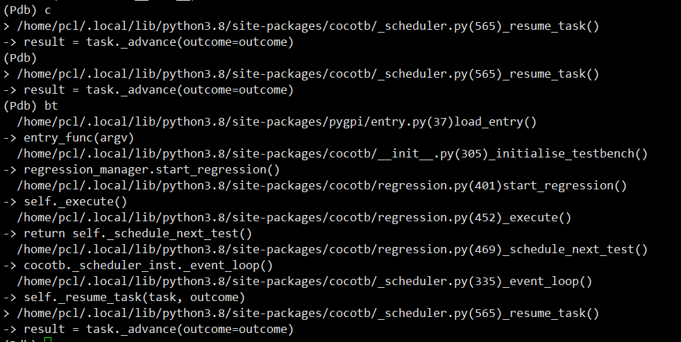
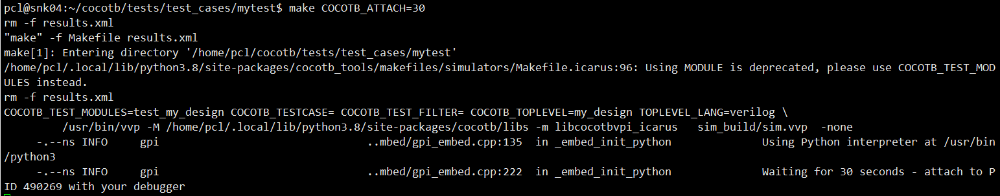
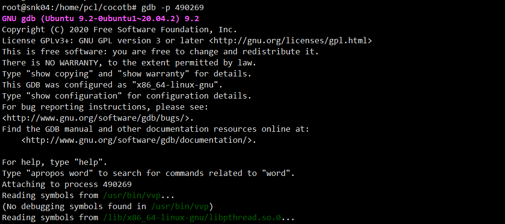
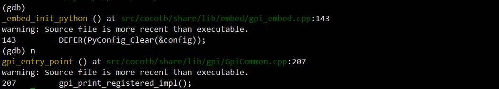
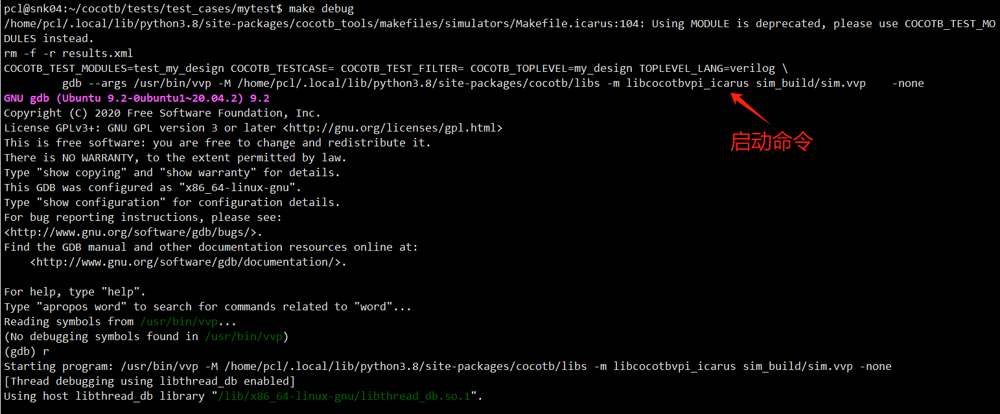
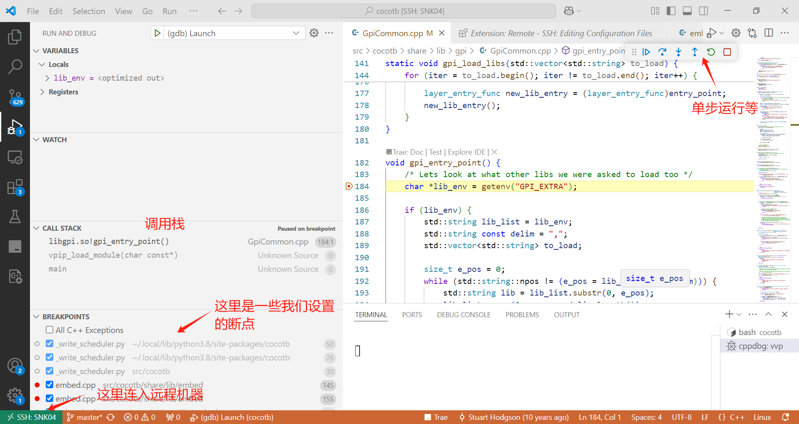
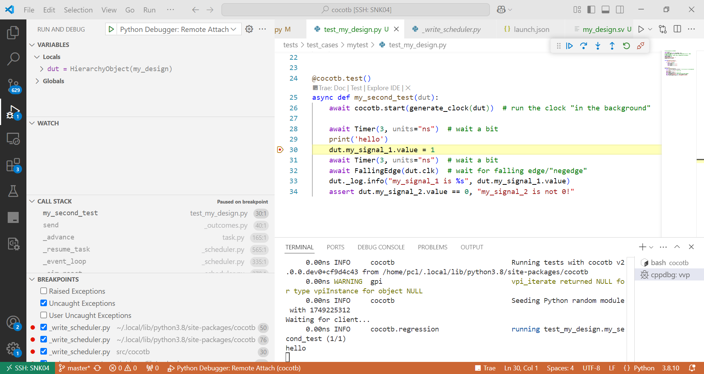

### 使用vscode远程调试cocotb（环境：linux+icarus）

如果需要对用户编写的cocotb代码（即python代码）进行调试，或者对cocotb底层的c++进行调试，在其官网（https://docs.cocotb.org/en/stable/troubleshooting.html）上提供了使用attach的方式，然后用pdb、gdb进行命令行式的调试。

对于python代码，由于这些代码并不是如一般情况下在python解释器里执行的，而是在c语言里，通过嵌入的方式来执行的，所以也就没法使用一般的如`python -m pdb code.py`的方式来启动调试，而是需要使用像remote_pdb的支持方式，让python代码执行到特定行时断住，以等待远程连接（如使用telnet \$host \$port)，然后在命令行里进行调试。

比如我们编写一段类似这样的测试代码：

```python
# test_my_design.py (extended)

import cocotb
from cocotb.triggers import FallingEdge, Timer
from remote_pdb import RemotePdb; rpdb = RemotePdb("127.0.0.1", 4000)
rpdb.set_trace()
# 上面是使用命令pdb进行调试，也可以使用如下面vscode attach的方法
# import debugpy
# debugpy.listen(4000)
# print('Waiting for client...')
# debugpy.wait_for_client()


async def generate_clock(dut):
    """Generate clock pulses."""

    for cycle in range(10):
        dut.clk.value = 0
        await Timer(1, units="ns")
        dut.clk.value = 1
        await Timer(1, units="ns")


@cocotb.test()
async def my_second_test(dut):
    await cocotb.start(generate_clock(dut))  # run the clock "in the background"

    await Timer(3, units="ns")  # wait a bit
    print('hello')
    dut.my_signal_1.value = 1
    await Timer(3, units="ns")  # wait a bit
    await FallingEdge(dut.clk)  # wait for falling edge/"negedge"
    dut._log.info("my_signal_1 is %s", dut.my_signal_1.value)
    assert dut.my_signal_2.value == 0, "my_signal_2 is not 0!"
```

然后在`make`执行仿真时，会暂停等待连接，如下图：



我们另起一个窗口，运行：`telnet 127.0.0.1 4000`（或者使用平替`rlwrap nc 127.0.0.1 4000`)，就可以进入pdb命令行界面了。



这里我们可以查看代码，或者设置断点，如使用 `b 17`来设置当前文件的断点，或者指明其他文件，如

`b /home/pcl/.local/lib/python3.8/site-packages/cocotb/_scheduler.py:565`来进入cocotb的协程调度器中（注：这里请根据自身python包的安装路径相应修改）。

然后执行`continue`命令，就会停在我们设置的断点处：



上面的方式，可以调试自己编写的或cocotb本身的python代码，对于c++部分代码，则需要使用gdb。我们知道gdb可以直接附着到特定的进程，如果我们知道目标进程的id，可以使用`gdb attach $pid`进入到gdb的调试交互命令行。为了让用户更快地找到这个进程id，当启动时设置了环境变量`COCOTB_ATTACH=300`后，cocotb将自动进行等待（sleep设置的秒数，如这里的300秒），并打印要attach的pid。



比如，这里显示目标进程id是490269，然后我们另起一个窗口，输出`gdb -p 490269`即可连入。





调试c++和调试python有点不同，并不一定要使用外部attach的方式，而是可以直接从gdb启动进程，只是因为cocotb支持不同的仿真器，被调试程序会根据具体的仿真器选型而有变化。比如上图中，我使用的是icarus，其仿真程序的名称是vvp（以及编译程序是iverilog），上图中可以看到gdb实际attach的就是vvp进程。

如果我们知道vvp启动命令，以及所需要的环境变量（如COCOTB_TEST_MODULES来指定用户编写的python代码），那可以是直接用类似下列命令来启动：

```
PYGPI_PYTHON_BIN=/usr/bin/python3 COCOTB_TEST_MODULES=tests.test_cases.mytest.test_my_design gdb /usr/bin/vvp -M /home/pcl/.local/lib/python3.8/site-packages/cocotb/libs -m libcocotbvpi_icarus /home/pcl/cocotb/tests/test_cases/mytest/sim_build/sim.vvp
```

 其中，`PYGPI_PYTHON_BIN=/usr/bin/python3 `和`COCOTB_TEST_MODULES=tests.test_cases.mytest.test_my_design gdb`表示设置环境变量（这是libcocotbvpi_icarus 所需要的），然后用gdb启动vvp程序，并设定vvp使用vpi接口时所需要的动态库和动态库所在目录，最后是被仿真程序所在的路径（如上面的sim.vvp，是我事先使用iverilog编译.v文件所产生的）。

这样，我们就进入了gdb调试vvp以及libcocotbvpi_icarus的命令行，实际cocotb的c++代码是在libcocotbvpi_icarus中的。

注：gdb调试c++的一个前提是编译时，启动了调试选项（-g）。直接使用pip安装cocotb并没有调试信息，需要从源码编译。

直接使用gdb运行来调试，需要有环境变量的配置和HDL源码文件的编译，略显繁琐。其实在cocotb中，有一个未在文档中提及的选项，可以通过make debug来快速进入调试命令行。



注：如果您使用的是比较早期版本的cocotb，可能会在启动命令行时有些小瑕疵，可以关注下这个[PR](https://github.com/cocotb/cocotb/pull/4578)

写到这里，我们终于想起标题了 ^^

既然可以从gdb直接进入c++的调试，那么就可以在vscode中配置以启动调试。比如使用下列配置：

```json
{
      "name": "(gdb) Launch",
      "type": "cppdbg",
      "request": "launch",
      "program": "/usr/bin/vvp",
      "args": [
        "-M",
        "/home/pcl/.local/lib/python3.8/site-packages/cocotb/libs",
        "-m",
        "libcocotbvpi_icarus",
        "/home/pcl/cocotb/tests/test_cases/mytest/sim_build/sim.vvp"
      ],
      "stopAtEntry": false,
      "cwd": "/home/pcl/cocotb",
      "environment": [
        {
          "name": "PYGPI_PYTHON_BIN",
          "value": "/usr/bin/python3"
        },
        {
          "name": "COCOTB_TEST_MODULES",
          "value": "tests.test_cases.mytest.test_my_design"
        },
      ],
      "externalConsole": false,
      "MIMode": "gdb",
      "setupCommands": [
        {
          "description": "Enable pretty-printing for gdb",
          "text": "-enable-pretty-printing",
          "ignoreFailures": true
        },
        {
          "description": "Set Disassembly Flavor to Intel",
          "text": "-gdb-set disassembly-flavor intel",
          "ignoreFailures": true
        }
      ]
    }
```

这里的环境变量设置、启动命令的参数，可以参考`make debug`命令给出的提示。这样我们就可以在vscode中设置断点、查看变量等。

如果您像我一样，是在远程的linux系统中运行cocotb，但使用windows编写代码。那么可以借助vscode的remote-ssh，在进行远程链接配置后连入，然后就可以像本地一样调试代码了。



如果是python代码，则可以借助vscode的python debugger所具有的remote attach功能来实现，只是在代码中remote_pdb相关的代码要替换为debugpy（这个包需要安装）。如：

```python
# test_my_design.py (extended)

import cocotb
from cocotb.triggers import FallingEdge, Timer
# from remote_pdb import RemotePdb; rpdb = RemotePdb("127.0.0.1", 4000)
# rpdb.set_trace()
# 上面是使用命令pdb进行调试，也可以使用如下面vscode attach的方法
import debugpy
debugpy.listen(4000)
print('Waiting for client...')
debugpy.wait_for_client()

# other code ...
```

然后在vscode中的调试配置文件（launch.json）中添加调试配置：

```json
    {
      "name": "Python Debugger: Remote Attach",
      "type": "debugpy",
      "request": "attach",
      "connect": {
        "host": "localhost",
        "port": 4000
      },
      "pathMappings": [
        {
          "localRoot": "/",
          "remoteRoot": "/"
        }
      ], 
      "justMyCode": false
    }
```

这里的`pathMappings`是为了支持在不同主机上而设置的，在这里，我们是同一主机，直接使用相同的路径映射即可。

如果是在远程主机内运行的，但因为我们已经使用remote-ssh进行了一次跳转，所以在这里仍然是在同一主机（都在远程）上的，所以仍然是这样的设置。

先启动仿真（如运行`make`命令），程序会等待连入，然后在vscode中启动调试，则可以看到类似的画面：




